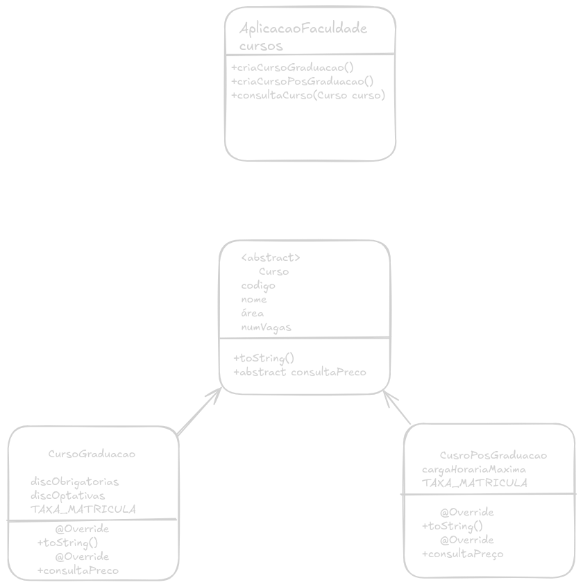

# Sistema de Gerenciamento de Cursos

Atividade desenvolvida para a disciplina de **Programação Orientada a Objetos(MATA55)**.

Objetivo é simular uma aplicação que gerencia cursos de graduação e pós-graduação de uma faculdade.

## 🚀Funcionalidades
- [ ] Cadastra curso de Graduação
- [ ] Cadastra curso de Pós-Graduação
- [ ] Consulta preço do curso de Graduação
- [ ] Consulta preço do curso de Pós-Graduação
- [ ] Consulta de cursos

## 📐Diagrama de classes

## 🛠️Tecnologias Utilizadas
* **Linguagem:** Java 
* **IDE:** BlueJ/IntelliJ

## 📦Como Executar
1. Clone o repositório.
2. Abra o projeto no **BlueJ** (ou IntelliJ).
3. Execute a classe 'AplicacaoFaculdade' (método 'main').

## 📋Backlog (Tarefas)

- [ ] Cria Curso
- [ ] Cria Curso Pós-Graduação
- [ ] Cria método para consultar preço de Pós-Graduação
- [ ] Cria Curso Graduação
- [ ] Cria método para consultar preço de Graduação
- [ ] Criar AplicaoFaculdade
- [ ] Criar método para criar curso graduacao
- [ ] Criar método para criar curso posGraduacao
- [ ] Criar método para consultar curso
- [ ] Criar interface